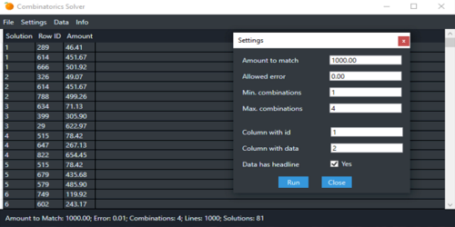

## Summary

The Combinatorics Solver tries to combine a given set of numbers to reach a specific total amount. The data can be imported as Excel or CSV file. One possible application could be in accounting when you need to find the postings which make up a certain amount.

With Karaka you have one partner who can provide many tools and software solutions you are used to at fair and reasonable prices even for small organizations and companies/startups. Our solutions can be used independently from each other or fully integrated with other solutions we provide. By choosing Karaka as your partner you'll be able to adjust your software based on the changes in your requirements without worrying about integration and workflow optimization.

## Features

* Define how many numbers should be combined as a maximum in order to reach the total amount
* Allow an error component (useful for allowing small differences for achieving the total amount)
* Multiple solutions can be returned if available
* Automatically warn if the settings may cause problems due to the amount of possible combinations

## Dependencies

* Microsoft Windows 7 or newer

### Developer tools

* Language: C# (WPF)
* Libraries: OpenXML
* Tools: Visual Studio

## Images

## Legal

* [Terms of Service](https://jingga.app/en/terms)
* [License](https://github.com/Karaka-Management/CombinatoricsSolverApp/blob/master/LICENSE.txt)

### Disclaimer

Checking for possible matches can reach a very large amount of combinations really quick. For example, if there are 100 numbers and the possible total sum should be achieved by adding 1 to 6 numbers out of these 100, then there are up to 1,271,427,895 (`Σ[nCk], k = 1...6 and n = 100`) combinations which might be checked. This means that depending on the data size the calculation can take very long or may even fail.

You can use the demo application for some tests in order to see if the software fulfills your needs.

> The demo application only checks up to 30 numbers with a maximum of 4 combinations.
